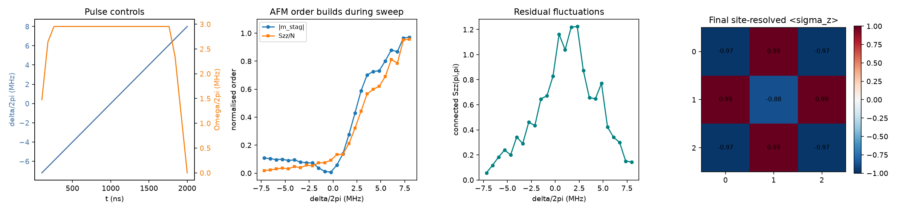
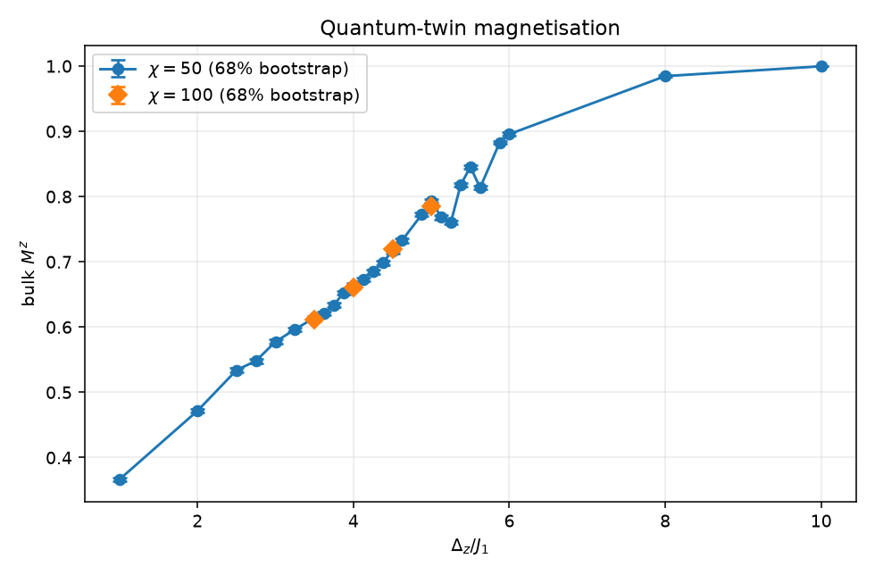
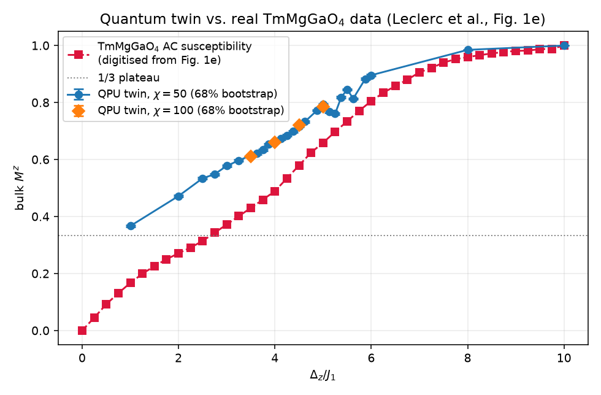
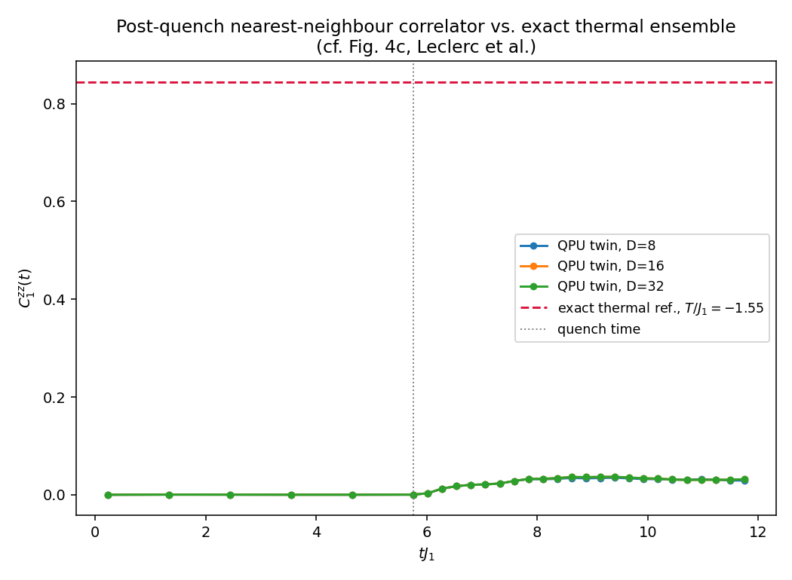

# Building a Quantum Twin of TmMgGaO₄

*A CERN Quantum Technology Initiative (QTI) hackathon writeup.*

## The pitch

Analogue quantum simulators are usually benchmarked against toy Hamiltonians — clean, generic models chosen because they're easy to write down, not because they correspond to anything you could put under a microscope. The CERN QTI hackathon challenge we took on asked a sharper question: can a neutral-atom quantum processor act as a **quantum twin** of an actual material — reproducing real lab measurements, atom for atom?

The material in question is **TmMgGaO₄**, a triangular-lattice frustrated magnet, and the inspiration was a genuinely striking result: Pasqal's 256-qubit Rydberg simulator recently reproduced the magnetisation curve of real TmMgGaO₄ crystals, one-to-one (Leclerc et al., [arXiv:2603.20372](https://arxiv.org/abs/2603.20372)). Rydberg arrays realise the 2D transverse-field Ising model *natively* — no Trotterisation, no gate-synthesis overhead — and TmMgGaO₄'s low-energy physics happens to be exactly that model on a triangular lattice. The device and the material speak the same language.

The challenge walked participants through that same path in three phases: warm up on a simple, well-understood square-lattice antiferromagnet, build the real quantum twin, then push into territory where classical simulation starts to break. Leclerc et al.'s own result used 256 real qubits; the hackathon itself is deliberately **emulation-only** (no QPU access required, realistically ~64 qubits on `emu-mps`) — the point is validating the same Hamiltonian mapping and methodology on classical emulators of the device, not claiming hardware time we didn't have.

All code is [on GitHub](.) — three standalone Pulser notebooks under `notebooks/`.

---

## Why triangular lattices are interesting at all

Put antiferromagnetically-coupled spins on a square lattice and the ground state is easy: alternate up/down, checkerboard style, every bond happy. Put them on a **triangle** and you can't do that — any three mutually-neighbouring spins can satisfy at most two of the three antiferromagnetic bonds around the loop; whichever pair you align opposite to their shared neighbour, the third bond is stuck unsatisfied. This is *geometric frustration*.

The consequence isn't just "a bit of leftover energy" — it's that this two-satisfied-one-frustrated compromise can be reached in many different, unrelated ways across the lattice. Flip a frustrated spin on one triangle to try to fix it, and you just move the frustration to a neighbouring triangle instead of removing it. The result is a massive number of equal-energy ground states rather than one clean ordered pattern: on the classical triangular Ising antiferromagnet this is an *extensive* degeneracy (Wannier's classic 1950 result — the system famously fails to order even at zero temperature). That huge, floppy ground-state manifold is the actual mechanism behind "triangular-lattice magnets are a hotbed of exotic physics": with no single winner among the ground states, weak extra interactions or quantum fluctuations get an outsized say in which order (if any) the real system settles into — spin liquids, competing orders, and, in TmMgGaO₄'s case, the specific 1/3-plateau structure discussed next, rather than the square lattice's simple Néel state with the numbers changed.

TmMgGaO₄'s Tm³⁺ ions sit on exactly this triangular lattice, and strong crystal-field anisotropy makes each ion behave, at low energy, like an effective spin-1/2 with a preferred axis — which is what licenses treating a rare-earth oxide as a Pauli-operator model at all. The material Hamiltonian (Eq. 1 of Leclerc et al.) is:

$$
\frac{\hat H_{TMGO}}{\hbar} = J_1\!\!\sum_{\langle i,j\rangle}\!\!\hat\sigma^z_i\hat\sigma^z_j \;+\; J_2\!\!\sum_{\langle\langle i,j\rangle\rangle}\!\!\hat\sigma^z_i\hat\sigma^z_j \;+\; \sum_{i=1}^N\left(\Delta_x\hat\sigma^x_i - \Delta_z\hat\sigma^z_i\right)
$$

Term by term: J₁ is the frustrated nearest-neighbour coupling; a small J₂ ≈ 0.05·J₁ breaks the massive classical degeneracy left over from frustration and selects a **1/3-magnetisation plateau** (↑↑↓ order) instead of Néel order; Δx ≈ 1.08·J₁ is an *intrinsic* transverse field from residual crystal-field mixing (not a knob you control — and not small, either); and Δz is the real, tunable applied magnetic field, with Δz/J₁ ≈ 1.543·μ₀H(T). Sweep Δz and you sweep the magnet from a fully polarised paramagnet (Mᶻ → 1) down through a genuine quantum phase transition into the frustration-selected 1/3-order phase (Mᶻ → 1/3).

---

## Phase 1 — Warm-up: proving the toolchain on a simple square-lattice antiferromagnet

Before mapping a real material onto Rydberg atoms, we reproduced the cleaner landmark result this whole approach is built on: Scholl et al.'s adiabatic preparation of a 2D antiferromagnet on a square array (Nature 2021, [arXiv:2012.12268](https://arxiv.org/abs/2012.12268)).

The physical picture underneath all three phases starts here. Pasqal's neutral-atom platform traps individual Rb atoms in optical tweezers and uses each one as an effective spin-1/2: the electronic ground state is spin down, and a laser-excited Rydberg state — enlarged, strongly interacting — is spin up. The global laser drive Ω competes with the Rydberg blockade, the fact that two nearby atoms can't both be excited at once. Sweeping the detuning δ from negative to positive tips the energetic balance from "stay in the ground state" to "excite if you can," and the blockade turns that competition into an alternating checkerboard pattern: exciting every atom is forbidden by blockade, but exciting every *other* atom isn't.

The recipe: pick a blockade radius in the checkerboard window (a < Rb < a√2), ramp the Rabi frequency up, sweep the detuning δ quasi-adiabatically from negative to positive, ramp back down to freeze the readout basis. Watch checkerboard order build.

Both the staggered magnetisation |m_stag| and the full structure factor Sᶻᶻ(π,π) climb together as the sweep crosses δ=0, and the final site-resolved ⟨σᵢᶻ⟩ pattern (rightmost panel) is a clean checkerboard. This was the deliberately unglamorous phase — the point was to prove the Pulser toolchain, the pulse-sequence logic, and the emulator round-trip all work end to end *before* spending any of that confidence on the harder mapping. It also surfaces something worth knowing early: the naive linear ramp that works cleanly at 3×3 does **not** trivially scale to 4×4 — the many-body gap shrinks, and this is flagged in the notebook as a guarded, optional cell rather than swept under the rug.

The notebook also carries a genuine escape hatch past that local ceiling: a guarded pipeline that submits the same detuning scan for a real 25-atom register to Pasqal Cloud's EmuMPS backend at two bond dimensions, with persistent batch IDs so a re-run never silently resubmits duplicate jobs — the same safety pattern used everywhere we talk to the cloud in this project.

---

## Phase 2a — The real thing: a quantum twin of TmMgGaO₄

This is the centrepiece. We map the material Hamiltonian above onto a Rydberg array via the paper's Eq. 4:

$$
\Delta_x(t) = \frac{\Omega(t)}{2}, \qquad \Delta_z(t) = \frac{\delta_U - \delta(t)}{2}, \qquad J_1 = \frac{C_6}{4 r_1^6}
$$

where δU is not an analytic shortcut but the register's actual, numerically-computed interaction offset: the full pairwise van der Waals sum over *every* atom pair in the array (not just the 6 nearest neighbours), averaged over all N=49 sites — at our register's spacing this comes out to δU ≈ 10.3·J₁. This isn't a numerical convenience; it's an operator-level identification H_QPU ≈ α_QPU·H_TMGO between the QPU's native van-der-Waals-plus-drive Hamiltonian and the material's — the actual content of the "quantum twin" claim.

We built the paper's own smallest reported bulk size — a 7×7, N=49 register — on Pulser's `MockDevice` rather than claiming a one-to-one match to Pasqal's real FM1 hardware: `MockDevice` gets the *dimensionless* ratio Δx/J₁=1.08 exactly right, but its C₆ coefficient differs from the physical Rydberg state, so the lattice spacing that comes out (~7.84 μm) isn't the paper's own ~9 μm. We say so directly in the notebook rather than letting a superficially-plausible number pass as a hardware match. Similarly, we evolve all 49 atoms but read observables off the central 5×5=25-site region with a single buffer layer of protection — a larger, statistically friendlier analysis window than the paper's own two-layer-buffer convention, at the cost of somewhat more boundary sensitivity. Both choices are flagged, not buried.

**Strategy.** Rather than one continuous sweep, we ran the paper's own point-by-point protocol: an independent quasi-adiabatic preparation (Rabi ramp-up, ~4 μs field sweep, fast ramp-down for readout) for each of 27 target fields spanning Δz/J₁ ∈ [1,10], at two bond dimensions (χ=50 for the full scan, χ=100 as a convergence check on points closest to the transition) — real jobs submitted to Pasqal Cloud's EmuMPS backend, with persistent batch IDs so re-running the notebook never resubmits duplicates. Every reported point also carries a 68% bootstrap interval from resampling the finite measurement shots, so the error bars you see are honest finite-sampling uncertainty, not decoration.

### The quantum-twin magnetisation curve

Before bringing the real material into it at all, the twin's own curve is the first deliverable in its own right: bulk Mᶻ against Δz/J₁, at both bond dimensions, with 68% bootstrap error bars on every point.

The curve runs from Mᶻ ≈ 1 deep in the paramagnet down toward the 1/3-plateau as Δz/J₁ decreases, with χ=50 and χ=100 tracking each other closely wherever both were run — the first, on-its-own-terms convergence check, before the curve is judged against anything external.

### Comparing against the real material

The genuinely satisfying part: we digitised the actual experimental AC-susceptibility curve from Fig. 1e of the paper's own PDF (pixel-calibrated against the plot's own axis tick marks — not fabricated placeholder data), and overlaid it directly against the bootstrap-resampled magnetisation curve.

As a sanity check on the digitisation itself: the extracted curve's elbow sits at Δz/J₁ ≈ 4 and its inflection near Δz/J₁ ≈ 6 — exactly where the paper's own text places the quantum critical point and the classical crossover, respectively. That's independent confirmation the digitisation is trustworthy before we even use it. Reading the comparison honestly means reading it alongside the two caveats above: any residual gap between our twin and the real crystal in the intermediate, quantum-critical region is exactly where finite size, the single buffer layer, and the `MockDevice` approximation are expected to matter most — the two classical endpoints, where those effects bite least, are where we'd expect (and see) the closest agreement.

We also computed the connected structure-factor diagnostic Sᶻᶻ(q_1/3) (the paper's Fig. 2B) as a secondary check, and pushed further than a qualitative look: a systematic varying-window cubic-fit procedure (17 candidate field windows, each fit accepted only if it clears a minimum-point count and its extremum isn't sitting on the window's edge) extracts an N=49 **pseudo-critical crossover** — explicitly not the thermodynamic critical point, which the paper itself only claims at its largest system, N=256, where "bulk behaviour dominates." The spread across accepted windows becomes a fit-window-sensitivity band, kept visually and numerically distinct from the bootstrap sampling error bars — two different uncertainties that are easy to conflate and important not to.

Reporting a crossover *with its window-sensitivity band attached*, rather than a single clean-looking critical field, is the more honest deliverable: it tells a reader exactly how much of that number is physics and how much is which fitting window you happened to pick.

---

## Phase 2b — Probing the classical frontier with a quench

Phase 2a is a fidelity check — DMRG and QMC also prepare ground states well, so equilibrium reproduction alone doesn't prove a quantum device was *necessary*. The open-exploration phase of the challenge asks a different question: where does a quantum simulator stop being merely convenient and start being the only tool that works?

The paper's answer is post-quench dynamics (their Fig. 4). Tensor-network emulators like `emu_mps` compress a many-body state using a bond dimension χ; after a sudden quench, entanglement grows in time, so the χ needed for an accurate description grows with it — until no achievable χ is enough, and the classical emulation simply fails. A quantum device compresses nothing, so it keeps going exactly where the emulator can't.

**Protocol** (mirroring the paper's Ext. Dat. Fig. 4b/S2B): prepare near the paramagnetic product state |↑…↑⟩ at large Δz/J₁, then abruptly square-pulse-quench Δz/J₁ toward or inside the 1/3-ordered phase, and hold — tracking the nearest-neighbour correlator

$$
C_1^{zz}(t) = \frac{1}{N_b'}\sum_{\langle i,j\rangle \in \text{bulk}} \langle \hat\sigma^z_i(t)\hat\sigma^z_j(t)\rangle
$$

exactly as the paper defines it. One subtlety worth flagging for anyone reusing this code: `emu_mps.CorrelationMatrix` returns *occupation* correlations ⟨nᵢnⱼ⟩, not ⟨σᵢᶻσⱼᶻ⟩ directly. Since σᶻ = 1−2n, the correct non-connected conversion is ⟨σᵢᶻσⱼᶻ⟩ = 1 − 2⟨nᵢ⟩ − 2⟨nⱼ⟩ + 4⟨nᵢnⱼ⟩ — not the simpler factor-of-4 shortcut, which is only valid for the *connected* covariance used in Phase 2a's structure factor. Small distinction, easy to get quietly wrong.

The notebook splits this into two complementary parts, deliberately at two different system sizes: **Part A** goes small enough (N=9) that we can check thermalisation against an *exact* reference with zero stochastic error; **Part B** goes to the paper's own N=49 specifically because N=9 is too small to show a classical method struggling at all.

### Part A — An exact thermal reference, for free (N=9)

The paper compares long-time dynamics against a thermal ensemble at an effective temperature fixed by energy conservation (their Eq. 8), computed via a stochastic-series-expansion (QMC-SSE) sampler — out of scope to build in hackathon time. But at our system size (N=9 for the small demo), we could do something strictly better: solve for the exact thermal ensemble via full diagonalisation of H_QPU, with zero stochastic error, and compare directly. Bisecting in β=1/T correctly finds **negative effective temperatures** when the quench lands inside the 1/3-ordered phase — the same regime the paper itself flags, and our T_eff/J₁ = −1.55 matches their reported kBT/(ħJ₁) = −1.25 at a similar quench target in sign and order of magnitude.

Immediately after the quench, C₁ᶻᶻ drops and oscillates in a band that straddles the thermal reference line rather than sitting far above it or collapsing cleanly onto it — a legitimate intermediate case: the correlator is visibly relaxing toward the thermal value, but at N=9 and tJ₁ ≲ 12 we're watching coherent oscillations decay, not a settled late-time plateau. Extending the hold time on **Pasqal Cloud** out to tJ₁≈36 answers the obvious next question: the oscillations *don't* damp out — they persist with roughly constant amplitude, in a band that sits mostly below the thermal line rather than shrinking onto it. That's not a bug either. Eigenstate thermalisation is a statement about systems large enough to act as their own heat bath; at N=9, unbuffered, there simply aren't enough degrees of freedom for that, so the closed system shows persistent quasi-periodic revivals instead. This is exactly why the paper makes its thermalisation claim at N=100–256, not here — thermalisation is an emergent, large-N phenomenon, and a genuine test of it needs a system big enough to exhibit it.

### Part B — Where does the classical emulator actually break? (N=49)

Part A is reassuring but not yet the point: at N=9 the Hilbert space is small enough that exact diagonalisation *is* the reference, which is precisely why it can't show a classical method failing. Part B scales to the paper's own N=49 register (reusing Phase 2a's device/mapping cells, so this notebook stays standalone) and sweeps both quench hardness (Δz/J₁) and bond dimension χ ∈ {50,100,200,300}, using the *disagreement between* χ values as a measurable proxy for where the classical description stops being trustworthy.

The result: curves overlap at early times (weak entanglement, every χ still accurate), separate through an intermediate window, then reconverge at late times. The widest pairs — |χ300−χ50| and |χ300−χ100| — peak well above a divergence threshold through tJ₁≈5–10, while the narrowest high-χ pair, |χ300−χ200|, barely grazes it, meaning χ≥200 is close to converged and the low-χ divergence is a genuine departure from a trustworthy reference, not two poor approximations disagreeing with each other. The rise is the real signal — the onset of classical intractability, scaling cleanly with the χ gap. The rapid decay afterward is a **finite-size recurrence, not classical catch-up**: at 49 atoms the state partially returns toward its starting point, entanglement drops, and even χ=50 works again. At the paper's 256 qubits, that recurrence is pushed far outside the observation window and the breakdown is sustained rather than transient.

We went in expecting the classical breakdown to peak near the quantum critical point (Δz/J₁≈3.9), since entanglement generation should be strongest there. The sweep didn't show that cleanly — divergence crosses threshold at low field *and* again near 4.0, but not monotonically in between. We don't have a clean explanation, and we said so rather than smoothing it over: a likely confound is that at 49 atoms, each field value peaks and recurs at a different time, so whether a given quench clears threshold within our observation window depends partly on recurrence timing, not purely on how much entanglement it generates. Disentangling a genuine field-dependent trend from this finite-size artifact needs larger systems — a natural next step, and one squarely beyond a single-quench hackathon demo.

---

## What we'd do next

* **System size.** Push `l_bulk` to 6/9 (N=100/169) on GPU to watch the Phase 2a pseudo-critical crossover sharpen toward the paper's own N=256 estimate, and to separate genuine field-dependence from finite-size recurrence in Phase 2b Part B.
* **Bond dimension.** The paper still finds D=256 not fully converged at their largest system — always report a D-scan alongside any headline curve, not just a single "converged-looking" run.
* **The real FM1 device geometry.** Swapping `MockDevice` for the paper's actual Rydberg level/C₆ would close the gap between our dimensionless-ratio match and a genuine one-to-one hardware reproduction.
* **A real QMC-SSE thermal sampler** would remove the N≲18 ceiling that exact diagonalisation imposes on the Phase 2b Part A thermal reference, and is the paper's own approach at scale.

## Why this matters beyond one hackathon

The interesting claim here isn't "we ran Pulser." It's that a neutral-atom processor's *native* Hamiltonian — van der Waals interactions plus a Rabi drive and detuning — maps almost operator-for-operator onto the microscopic physics of a real, characterised crystal. That's a qualitatively different kind of benchmark than reproducing a generic model system: it's a check against independent magnetometry on an actual material, with a clear, falsifiable target. And the Phase 2b result — honest about where it worked, where it didn't, and why — is the more useful kind of hackathon deliverable: not a number forced to look clean, but a documented account of exactly which physics is real signal and which is a finite-size artifact still waiting on a bigger system to resolve.

*Code, notebooks, and full derivations: see the repository.*

---

## References

Reference material for simulating the frustrated triangular-lattice antiferromagnet TmMgGaO₄ on a Rydberg atom array.

### The material

**[1]** Cevallos, Stolze, Kong & Cava, *Anisotropic magnetic properties of the triangular plane lattice material TmMgGaO₄*, Mater. Res. Bull. **105**, 154 (2018).
Discovery and synthesis. Crystal structure; Tm³⁺ on a triangular net.

**[2]** Shen et al., *Intertwined dipolar and multipolar order in the triangular-lattice magnet TmMgGaO₄*, Nat. Commun. **10**, 4530 (2019). [arXiv:1810.05054](https://arxiv.org/abs/1810.05054)
Neutron scattering. Three-sublattice order gives a magnetic Bragg peak at the **K point** — the order parameter the simulation must reproduce.

**[3]** Li et al., *Partial up-up-down order with the continuously distributed order parameter in the triangular antiferromagnet TmMgGaO₄*, Phys. Rev. X **10**, 011007 (2020).
Magnetisation data for comparison against emulation.

### The model

**[4]** Chen, *Intrinsic transverse field in frustrated quantum Ising magnets*, Phys. Rev. Research **1**, 033141 (2019).
Why a non-Kramers ion's two-singlet ground state acts as an intrinsic transverse field.

**[5]** Liu, Huang & Chen, *Intrinsic quantum Ising model on a triangular lattice magnet TmMgGaO₄*, Phys. Rev. Research **2**, 043013 (2020). [arXiv:1909.03608](https://arxiv.org/abs/1909.03608)
Establishes TmMgGaO₄ as the transverse-field Ising antiferromagnet on a triangular lattice. **The basis of the whole mapping.**

### Frustration and order by disorder

**[6]** Wannier, *Antiferromagnetism. The triangular Ising net*, Phys. Rev. **79**, 357 (1950). Erratum: Phys. Rev. B **7**, 5017 (1973).
Extensive ground-state degeneracy; residual entropy ≈ 0.323 k_B/site. The classical model never orders.

**[7]** Moessner & Sondhi, *Ising models of quantum frustration*, Phys. Rev. B **63**, 224401 (2001).

**[8]** Isakov & Moessner, *Interplay of quantum and thermal fluctuations in a frustrated magnet*, Phys. Rev. B **68**, 104409 (2003).
[7]+[8]: how a transverse field selects three-sublattice order via quantum order by disorder.

**[9]** Li et al., *Kosterlitz–Thouless melting of magnetic order in the triangular quantum Ising material TmMgGaO₄*, Nat. Commun. **11**, 1111 (2020).

**[10]** Hu et al., *Evidence of the Berezinskii–Kosterlitz–Thouless phase in a frustrated magnet*, Nat. Commun. **11**, 5631 (2020).
Experimental counterpart to [9].

**[11]** Dun et al., *Neutron scattering investigation of proposed Kosterlitz–Thouless transitions in the triangular-lattice Ising antiferromagnet TmMgGaO₄*, Phys. Rev. B **103**, 064424 (2021). [arXiv:2011.00541](https://arxiv.org/abs/2011.00541)
Inelastic neutron scattering fixes the effective Hamiltonian parameters. **Source for numerical values of J and Γ.**

### Rydberg platform

**[12]** Scholl et al., *Quantum simulation of 2D antiferromagnets with hundreds of Rydberg atoms*, Nature **595**, 233 (2021). [arXiv:2012.12268](https://arxiv.org/abs/2012.12268)
196 atoms; square **and** triangular arrays. The warm-up target.

**[13]** Leclerc et al. (PASQAL), *One-to-one quantum simulation of the low-dimensional frustrated quantum magnet TmMgGaO₄ with 256 qubits*, arXiv:2603.20372 (2026). [arXiv:2603.20372](https://arxiv.org/abs/2603.20372)
Closest existing work. 256-qubit Rydberg simulator of the TmMgGaO₄ Hamiltonian; magnetisation matches single-crystal susceptibility. Keeps both J₁ and J₂; probes the paramagnet → 1/3-order (√3×√3) transition; adds snapshot analysis and quench dynamics.

### Tools

- [Pulser](https://github.com/pasqal-io/Pulser) — pulse-level programming ([docs](https://pulser.readthedocs.io))
- emu-mps / emu-sv — tensor-network and state-vector emulators

### Reading order

[1] → [5] → [2] for the material and model. [6], [8] for the ordering mechanism. [11] for Hamiltonian parameters. [12] → [13] for the simulation protocol.
